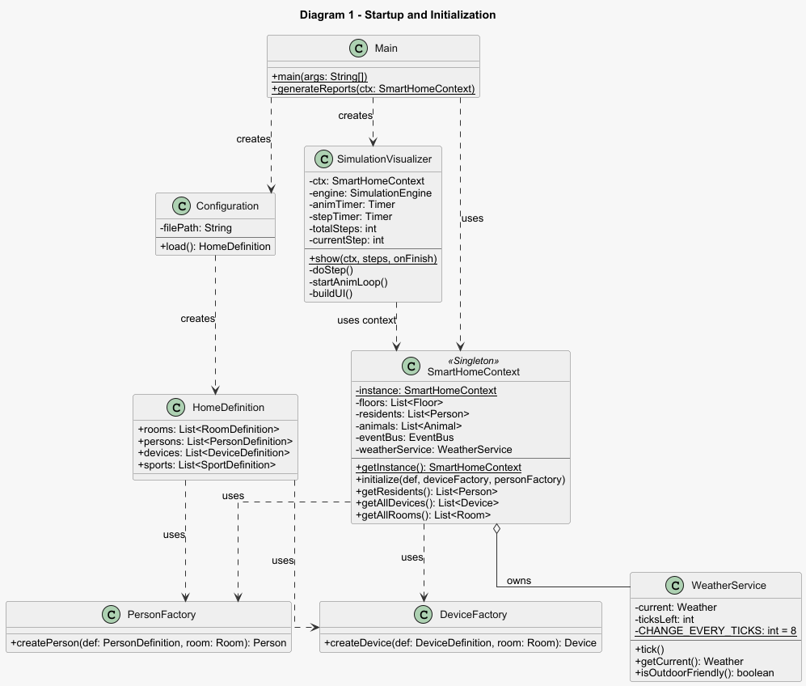
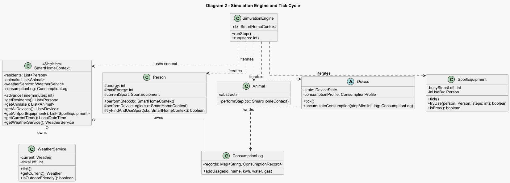
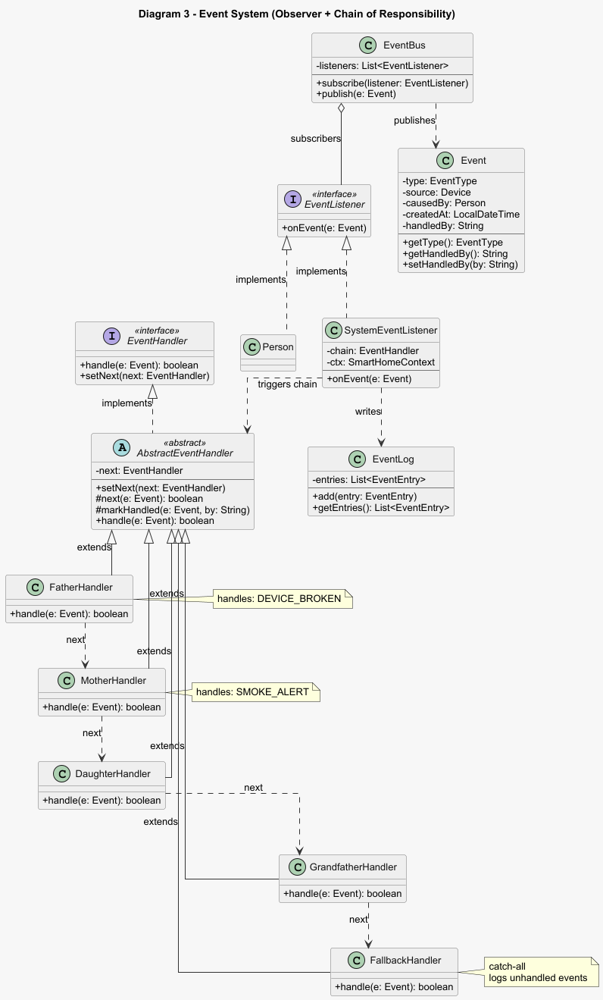
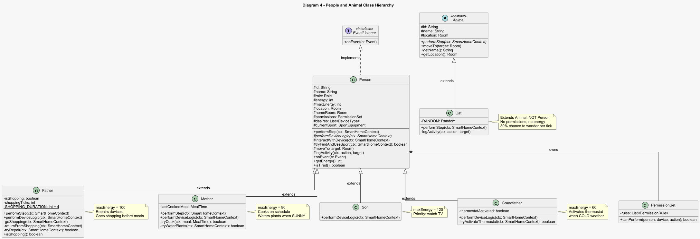
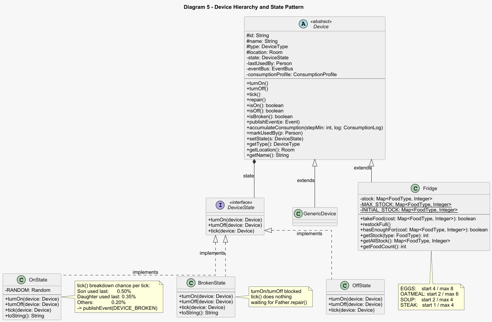
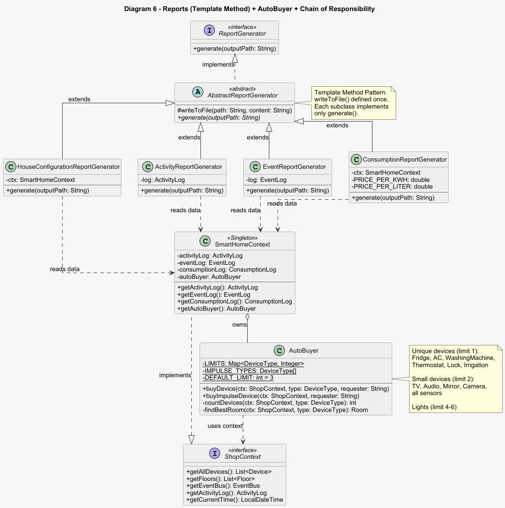

# Smart Home Simulator

**Language / Язык / Jazyk:**
[🇬🇧 English](README.md) | [🇷🇺 Русский](README_RU.md) | [🇨🇿 Čeština](README_CZ.md)

---

Simulace chytré domácnosti v Javě s pixelovým desktopovým vizualizérem. Projekt modeluje život české rodiny v chytré domácnosti - obyvatelé interagují se zařízeními, dodržují denní rutiny, reagují na počasí a spravují zásoby potravin. Celá simulace se přehrává v reálném čase přes GUI inspirované tahovými strategiemi.

---

## Obsah

- [Technologický stack](#technologický-stack)
- [Architektura systému](#architektura-systému)
- [Návrhové vzory](#návrhové-vzory)
- [Hierarchie tříd](#hierarchie-tříd)
- [Obyvatelé a chování](#obyvatelé-a-chování)
- [Systém zařízení](#systém-zařízení)
- [Systém jídla a nakupování](#systém-jídla-a-nakupování)
- [Systém počasí](#systém-počasí)
- [Systém energie](#systém-energie)
- [Vizualizér](#vizualizér)
- [Reporty](#reporty)
- [Spuštění projektu](#spuštění-projektu)
- [Konfigurace](#konfigurace)
- [Struktura projektu](#struktura-projektu)

---

## Technologický stack

| Technologie | Verze | Účel |
|---|---|---|
| Java | 23 | Hlavní jazyk |
| Java Swing | součást JDK | Desktopový GUI vizualizér |
| Jackson Databind | 2.17.1 | Parsování JSON konfigurace (`house.json`) |
| Maven | 3.x | Sestavovací systém |

---

## Architektura systému

### Diagram 1 - Spuštění a inicializace



### Diagram 2 - Simulační engine a cyklus tiků



### Diagram 3 - Systém událostí (Observer + Chain of Responsibility)



---

## Návrhové vzory

### State - stavy zařízení

Zařízení deleguje veškeré chování na aktuální stavový objekt. Při změně stavu je stavový objekt nahrazen celý.

```java
// Device.java
private DeviceState state = new OffState();

public void turnOn()  { state.turnOn(this);  }
public void turnOff() { state.turnOff(this); }
public void tick()    { state.tick(this);    }
```

| Stav | turnOn | turnOff | tick |
|---|---|---|---|
| `OffState` | přechod do OnState | nic | nic |
| `OnState` | nic | přechod do OffState | náhodná porucha |
| `BrokenState` | zablokováno | zablokováno | čeká na opravu |

### Observer - sběrnice událostí

`EventBus` zcela odděluje zařízení od obyvatel. Zařízení nezná existenci konkrétních tříd obyvatel.

```java
// Při inicializaci
eventBus.subscribe(father);
eventBus.subscribe(mother);
eventBus.subscribe(new SystemEventListener(chain, ctx));

// Při poruše zařízení
device.publishEvent(new Event(EventType.DEVICE_BROKEN, device, user));
// EventBus zavolá onEvent() u všech odběratelů
```

### Chain of Responsibility - zpracování událostí

Události procházejí řetězcem zpracovatelů. Každý buď událost zpracuje, nebo ji předá dále.

```java
father.setNext(mother);
mother.setNext(daughter);
daughter.setNext(grandfather);
grandfather.setNext(fallback); // catch-all
```

### Singleton - sdílený stav simulace

`SmartHomeContext` zaručuje, že všechny komponenty systému pracují se stejným stavem domácnosti.

```java
public static synchronized SmartHomeContext getInstance() {
    if (instance == null) instance = new SmartHomeContext();
    return instance;
}
```

`synchronized` zajišťuje thread safety - bez něj by mohla dvě simultánní volání vytvořit dva různé instance kontextu.

### Factory - vytváření objektů

Továrny zapouzdřují logiku vytváření. `SmartHomeContext` nikdy nevolá `new Father()` přímo.

```java
Person person = switch (def.role) {
    case FATHER      -> new Father(def.id, def.name, def.role, location, ps);
    case MOTHER      -> new Mother(def.id, def.name, def.role, location, ps);
    case SON         -> new Son(def.id, def.name, def.role, location, ps);
    case GRANDFATHER -> new Grandfather(def.id, def.name, def.role, location, ps);
    default          -> new Person(def.id, def.name, def.role, location, ps);
};
```

Přidání nového typu obyvatele vyžaduje pouze vytvoření nové třídy a jeden řádek v `PersonFactory`. `SmartHomeContext` a `SimulationEngine` se nemění.

### Template Method - generování reportů

Algoritmus zápisu do souboru je definován jednou v `AbstractReportGenerator`. Každý ze čtyř generátorů implementuje pouze svou vlastní formátovací logiku.

```java
public abstract class AbstractReportGenerator {
    protected void writeToFile(String path, String content) { ... }
    public abstract void generate(String outputPath);
}
```

---

## Hierarchie tříd

## Hierarchie tříd

### Diagram 4 - Hierarchie obyvatel a zvířat



### Diagram 5 - Hierarchie zařízení a vzor State



### Diagram 6 - Reporty, AutoBuyer a zpracovatelé událostí



---

## Obyvatelé a chování

| Obyvatel | Role | maxEnergy | Speciální chování |
|---|---|---|---|
| Otec | FATHER | 100 | Opravuje zařízení, jede nakupovat když chybí ingredience |
| Matka | MOTHER | 90 | Vaří podle rozvrhu, zalévá rostliny za slunečného počasí |
| Syn | SON | 120 | Priorita - sledovat TV ve svém pokoji |
| Dcera | DAUGHTER | 110 | Standardní chování |
| Děd | GRANDFATHER | 60 | Zapíná termostat při chladném počasí |
| Kočka | CAT | - | Nezávisle bloumá po domě, loguje WANDERED_TO / SLEEPING |

### Systém oprávnění (PermissionSet)

Každý obyvatel má sadu pravidel `PermissionRule` definující, které akce může provádět s kterými typy zařízení. Kočka nemá žádná oprávnění. Otec má plný přístup. Děti mohou ovládat pouze osvětlení, TV a audio.

---

## Systém zařízení

Domácnost podporuje 21 typů zařízení (`DeviceType`):

```
SMART_LIGHT, GROUP_LIGHT, GARDEN_LIGHT, SMART_LOCK,
MOTION_SENSOR, DOOR_WINDOW_SENSOR, SMOKE_GAS_SENSOR,
WATER_LEAK_SENSOR, AIR_QUALITY_SENSOR, OUTDOOR_CAMERA,
THERMOSTAT, HUMIDIFIER_AC, SMART_WASHING_MACHINE,
MULTIROOM_AUDIO, SMART_TV, SMART_MIRROR, SMART_BLINDS,
IRRIGATION_SYSTEM, PET_FEEDER, SMART_COFFEE_MACHINE, FRIDGE
```

### Pravděpodobnosti poruchy

Každý tik může zapnuté zařízení (`OnState`) náhodně selhat. Pravděpodobnost závisí na posledním uživateli:

| Uživatel | Pravděpodobnost poruchy za tik |
|---|---|
| Syn | 0,50% (50/10000) |
| Dcera | 0,35% (35/10000) |
| Ostatní | 0,20% (20/10000) |

Při poruše je událost `DEVICE_BROKEN` zveřejněna přes `EventBus`. `FatherHandler` ji zachytí a Otec jde v dalším tiku opravovat.

### AutoBuyer - automatické nákupy

Obyvatelé mají seznam přání (`desires`). Pokud chybějící zařízení není v domě, `AutoBuyer` ho koupí a umístí do příslušné místnosti. Každý typ má individuální limit:

| Limit | Zařízení |
|---|---|
| 1 (jedinečná) | Lednice, AC, Pračka, Termostat, Zámek, Závlaha, Kávovar, Krmítko |
| 2 | TV, Audio, Zrcadlo, Kamera, všechny senzory |
| 4-6 | Světla, žaluzie |

---

## Systém jídla a nakupování

### Rozvrh jídel

| Jídlo | Čas | Ingredience |
|---|---|---|
| Snídaně | 08:00-10:00 | Vejce x2, Ovesné vločky x1 |
| Oběd | 12:00-14:00 | Polévka x2 |
| Večeře | 18:00-20:00 | Steak x2 |

### Počáteční stav lednice

| Položka | Start | Maximum |
|---|---|---|
| Vejce | 4 | 8 |
| Ovesné vločky | 2 | 6 |
| Polévka | 2 | 4 |
| Steak | 1 | 4 |

Steak záměrně začíná na `1` při potřebě `2` - to zaručuje, že Otec pojede nakupovat před večeří při každém spuštění.

### Logika nakupování Otce

30 minut před každým jídlem (`07:30`, `11:30`, `16:30`) Otec zkontroluje lednici. Pokud chybí ingredience:

1. `location = null` - zmizí z mapy vizualizéru
2. Log: `SHOPPING: Left for groceries (4 ticks ~1h)`
3. Po 4 ticích se vrátí a zavolá `fridge.restockFull()`
4. Log: `RESTOCK: Fridge fully restocked`

Kontrola probíhá v `performStep()` před sportovní logikou - nakupování má nejvyšší prioritu a přeruší jakoukoli aktuální aktivitu.

---

## Systém počasí

Počasí se mění každých 8 tiků (~2 hodiny) náhodně s váženými pravděpodobnostmi:

| Počasí | Pravděpodobnost | Efekt |
|---|---|---|
| SUNNY | 50% | Matka zalévá rostliny (zapíná IRRIGATION_SYSTEM) |
| CLOUDY | 30% | Žádný efekt |
| RAINY | 15% | Blokuje všechny aktivity v zahradě |
| COLD | 5% | Děd zapíná termostat |

Za špatného počasí (`RAINY` / `COLD`) metody `tryFindAndUseSport()` a `interactWithDevice()` vylučují místnost Garden ze seznamu kandidátů.

---

## Systém energie

Každý obyvatel má parametr `energy` (0 - maxEnergy). Při nízké energii jde obyvatel odpočívat do své domovské místnosti.

| Událost | Změna energie |
|---|---|
| Jeden tik sportu | -15 |
| Jeden tik odpočinku | +10 |
| Jeden tik nečinnosti | +3 |

| Role | maxEnergy |
|---|---|
| GRANDFATHER | 60 |
| MOTHER | 90 |
| FATHER | 100 |
| DAUGHTER | 110 |
| SON | 120 |

Když `energy < 30` - obyvatel přeruší jakoukoli aktivitu a jde odpočívat. Když `energy >= 70` - je opět připraven na sport.

---

## Vizualizér

Desktopová Swing aplikace. Mapa domu 3x3 v pixelovém stylu.

```
[Garage]       [Garden]      [  -  ]
[SonRoom]      [LivingRoom]  [Kitchen]
[DaughterRoom] [Bathroom]    [  -  ]
```

### Architektura dvou časovačů

Vizualizér běží na dvou nezávislých instancích `javax.swing.Timer`:

```
animTimer  (30ms)       - plynule pohybuje sprity k cílovým pozicím (lerp interpolace)
                          překresluje obrazovku 33krát za sekundu
                          nic neví o simulaci

stepTimer  (nastavitelný) - spouští jeden tik přes engine.runStep()
                            aktualizuje cílové pozice spritů
                            frekvence řízena posuvníkem rychlosti
```

### Funkce GUI

| Funkce | Popis |
|---|---|
| Pixelové sprity | Každý obyvatel - barevný sprite s kódem role (OT, MA, SY, DC, DE, KK) |
| Plynulá animace | Lerp interpolace pozic spritů (30 fps) |
| Bublinky s akcemi | Poslední akce z ActivityLog zobrazena nad spritem |
| Ukazatel energie | Zelená - žlutá - červená lišta pod každým spritem |
| Únava | Poloprůhledný sprite + symbol `z` při odpočinku |
| Nakupování Otce | Sprite zmizí z mapy, v rohu se zobrazí `Otec: SHOPPING` |
| Ukazatel počasí | Stavový řádek: `☀ Sunny / ☁ Cloudy / ☂ Rainy / ❄ Cold` |
| Počítadlo zařízení | V každé místnosti: `dev:zapnuto/celkem` |
| Klikatelná lednice | Klik na Kitchen - popup s aktuálním stavem zásob |
| Tlačítko zpět | Snapshot-based rewind - krok zpět přes uložené snímky stavu |

### Snapshot-based rewind

Před každým tikem `doStep()` uloží snímek (`Snapshot`) - pozice všech obyvatel a zvířat, poslední akce, text logu, čas simulace. Stisknutí `◀ Prev` obnoví poslední snímek. Jde o vizuální návrat - stav Java objektů (zařízení, zásoby) se neobnovuje.

---

## Reporty

Po spuštění simulace stiskněte tlačítko `📋 Reports`. Soubory se uloží do složky `output/`:

| Soubor | Obsah |
|---|---|
| `house_configuration_report.txt` | Celá struktura domu - patra, místnosti, zařízení, obyvatelé |
| `activity_report.txt` | Log všech akcí všech obyvatel s časovými razítky |
| `event_report.txt` | Poruchy zařízení, kdo je zpracoval, přes který Handler |
| `consumption_report.txt` | Spotřeba elektřiny (kWh), vody (l), plynu (m³) za zařízení |

---

## Spuštění projektu

**Požadavky:** Java 23+, Maven 3.x

```bash
git clone https://github.com/ddbrdpl/smarthome_simulator.git
cd smarthome_simulator
mvn compile
mvn exec:java -Dexec.mainClass="cz.cvut.fel.omo.smarthome.Main"
```

### Ovládání GUI

| Tlačítko | Akce |
|---|---|
| `▶ Play` | Automatické spuštění simulace |
| `Next ▶` | Jeden tik vpřed (15 min herního času) |
| `◀ Prev` | Krok zpět (vizuální návrat) |
| `↺ Reset` | Restart |
| `📋 Reports` | Generování reportů do `output/` |
| Posuvník rychlosti | Řízení rychlosti přehrávání |
| Klik na Kitchen | Zobrazení obsahu lednice |

---

## Konfigurace

Soubor `src/main/resources/house.json` - kompletní konfigurace domu:

```json
{
  "rooms":   [ { "name": "Kitchen", "type": "KITCHEN" } ],
  "persons": [ { "id": "p1", "name": "Otec", "role": "FATHER", "room": "LivingRoom" } ],
  "devices": [ { "id": "d1", "name": "Kitchen Fridge", "type": "FRIDGE", "room": "Kitchen" } ],
  "sports":  [ { "id": "s1", "type": "TREADMILL", "room": "Garage" } ]
}
```

Pro změnu složení domu stačí upravit JSON - není potřeba měnit kód.

---

## Struktura projektu

```
src/main/java/cz/cvut/fel/omo/smarthome/
├── config/
│   ├── Configuration.java              - načítání house.json přes Jackson
│   ├── DeviceFactory.java              - továrna zařízení (Factory vzor)
│   ├── PersonFactory.java              - továrna obyvatel (Factory vzor)
│   └── *Definition.java                - DTO pro deserializaci JSON
├── consumption/
│   ├── ConsumptionLog.java
│   ├── ConsumptionProfile.java         - profil spotřeby zařízení
│   └── ConsumptionRecord.java
├── devices/
│   ├── Device.java                     - abstraktní třída zařízení
│   ├── DeviceState.java                - rozhraní stavu (State vzor)
│   ├── OnState.java                    - zapnuto (náhodná porucha)
│   ├── OffState.java                   - vypnuto
│   ├── BrokenState.java                - rozbitý
│   ├── GenericDevice.java              - standardní zařízení
│   ├── Fridge.java                     - lednice se systémem potravin
│   ├── DeviceType.java                 - enum 21 typů zařízení
│   └── FoodType.java                   - enum EGGS, OATMEAL, SOUP, STEAK
├── events/
│   ├── EventBus.java                   - sběrnice událostí (Observer vzor)
│   ├── EventListener.java              - rozhraní posluchače
│   ├── EventHandler.java               - rozhraní zpracovatele (CoR vzor)
│   ├── AbstractEventHandler.java       - základní zpracovatel řetězce
│   ├── FatherHandler.java              - zpracovává DEVICE_BROKEN
│   ├── MotherHandler.java              - zpracovává SMOKE_ALERT
│   ├── GrandfatherHandler.java         - zpracovává TEMPERATURE_LOW
│   ├── FallbackHandler.java            - catch-all zpracovatel
│   ├── SystemEventListener.java        - spouští řetězec zpracovatelů
│   ├── Event.java
│   └── EventType.java
├── house/
│   ├── SmartHomeContext.java           - Singleton, centrální kontext
│   ├── Floor.java
│   └── Room.java
├── logs/
│   ├── ActivityLog.java
│   ├── ActivityEntry.java
│   ├── EventLog.java
│   └── EventEntry.java
├── people/
│   ├── visualization/
│   │   └── SimulationVisualizer.java   - Swing GUI vizualizér
│   ├── Animal.java                     - abstraktní třída zvířat
│   ├── Cat.java                        - kočka (bloumá po domě)
│   ├── Person.java                     - základní třída obyvatele
│   ├── Father.java                     - opravuje zařízení, nakupuje
│   ├── Mother.java                     - vaří, zalévá rostliny
│   ├── Son.java                        - priorita TV
│   ├── Grandfather.java                - reaguje na chladné počasí
│   ├── PermissionSet.java              - sada oprávnění obyvatele
│   ├── PermissionRule.java             - jedno pravidlo přístupu
│   ├── Role.java                       - enum rolí
│   └── DeviceAction.java               - enum akcí TURN_ON / TURN_OFF
├── reports/
│   ├── ReportGenerator.java            - rozhraní (Template Method)
│   ├── AbstractReportGenerator.java    - základní generátor
│   ├── HouseConfigurationReportGenerator.java
│   ├── ActivityReportGenerator.java
│   ├── EventReportGenerator.java
│   └── ConsumptionReportGenerator.java
├── shop/
│   ├── AutoBuyer.java                  - nakupuje zařízení s limity
│   └── ShopContext.java                - rozhraní (ISP ze SOLID)
├── simulation/
│   ├── SimulationEngine.java           - hlavní smyčka simulace
│   ├── MealTime.java                   - rozvrh jídel
│   ├── Weather.java                    - enum počasí s vahami
│   └── WeatherService.java             - služba změny počasí
├── sports/
│   ├── SportEquipment.java             - sportovní vybavení s časovačem
│   └── SportType.java                  - enum typů vybavení
└── Main.java                           - vstupní bod + generování reportů

src/main/resources/
└── house.json                          - konfigurace domu

output/
├── house_configuration_report.txt
├── activity_report.txt
├── event_report.txt
└── consumption_report.txt
```

---

## Plány pro v2

- Denní rozvrh - ráno kuchyň, večer obývací pokoj
- Interakce mezi obyvateli - soutěžení o vybavení a TV
- Noční režim - po 22:00 se světla zhasnou, všichni jdou do pokojů
- Unit testy - pokrytí pro `Fridge`, `MealTime`, `AutoBuyer`, `PermissionSet`
- Pestřejší menu s rozšířeným seznamem potravin
